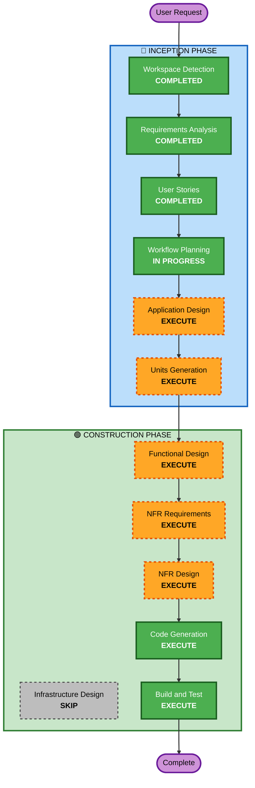

# Execution Plan

## Detailed Analysis Summary

### Change Impact Assessment
- **User-facing changes**: Yes - 고객 주문 UI, 관리자 대시보드, 주방 디스플레이 3개 인터페이스
- **Structural changes**: Yes - 전체 시스템 신규 구축 (Backend + Frontend + DB)
- **Data model changes**: Yes - 매장, 테이블, 메뉴, 주문, 결제, 세션 등 전체 스키마 설계 필요
- **API changes**: Yes - REST API 전체 설계 필요 + SSE 엔드포인트
- **NFR impact**: Yes - 실시간 통신(SSE), 세션 관리, 인증/인가

### Risk Assessment
- **Risk Level**: Medium (신규 프로젝트이나 복잡한 실시간 통신 및 다중 인터페이스)
- **Rollback Complexity**: Easy (Greenfield - 롤백 불필요)
- **Testing Complexity**: Moderate (SSE 실시간 통신, 세션 관리, 다중 사용자 유형 테스트)

## Workflow Visualization



### Text Alternative
```
Phase 1: INCEPTION
  - Workspace Detection (COMPLETED)
  - Requirements Analysis (COMPLETED)
  - User Stories (COMPLETED)
  - Workflow Planning (IN PROGRESS)
  - Application Design (EXECUTE)
  - Units Generation (EXECUTE)

Phase 2: CONSTRUCTION (per-unit)
  - Functional Design (EXECUTE)
  - NFR Requirements (EXECUTE)
  - NFR Design (EXECUTE)
  - Infrastructure Design (SKIP)
  - Code Generation (EXECUTE)
  - Build and Test (EXECUTE)
```

## Phases to Execute

### 🔵 INCEPTION PHASE
- [x] Workspace Detection (COMPLETED)
- [x] Requirements Analysis (COMPLETED)
- [x] User Stories (COMPLETED)
- [x] Workflow Planning (IN PROGRESS)
- [ ] Application Design - EXECUTE
  - **Rationale**: 신규 시스템으로 컴포넌트 식별, 서비스 레이어 설계, 컴포넌트 간 의존성 정의 필요
- [ ] Units Generation - EXECUTE
  - **Rationale**: 13개 FR, 11개 US를 가진 복잡한 시스템으로 병렬 개발 가능한 단위로 분해 필요

### 🟢 CONSTRUCTION PHASE (per-unit)
- [ ] Functional Design - EXECUTE
  - **Rationale**: 데이터 모델, API 설계, 비즈니스 로직(세션 관리, 주문 상태 흐름, 결제 상태) 상세 설계 필요
- [ ] NFR Requirements - EXECUTE
  - **Rationale**: SSE 실시간 통신, JWT 인증, 세션 관리, 파일 업로드 등 기술 스택 선정 및 NFR 정의 필요
- [ ] NFR Design - EXECUTE
  - **Rationale**: NFR 패턴(인증 미들웨어, SSE 관리, 에러 핸들링 등) 설계 필요
- [ ] Infrastructure Design - SKIP
  - **Rationale**: 로컬/온프레미스 배포로 클라우드 인프라 설계 불필요. 단순 Node.js 서버 실행.
- [ ] Code Generation - EXECUTE (ALWAYS)
  - **Rationale**: 코드 구현 필수
- [ ] Build and Test - EXECUTE (ALWAYS)
  - **Rationale**: 빌드 및 테스트 지침 필수

## Extension Compliance
| Extension | Status | Notes |
|-----------|--------|-------|
| security/baseline | Disabled | Q14: B - MVP/프로토타입 수준, Security rules 미적용 |

## Success Criteria
- **Primary Goal**: 테이블오더 서비스 MVP 구축 (고객 주문 + 관리자 모니터링 + 결제 상태 + 주방 디스플레이)
- **Key Deliverables**: Backend API, Frontend (고객/관리자/주방 3개 인터페이스), MySQL 스키마, SSE 실시간 통신
- **Quality Gates**: 모든 US의 Acceptance Criteria 충족, 단위 테스트 통과
